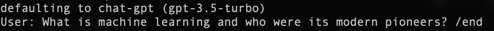
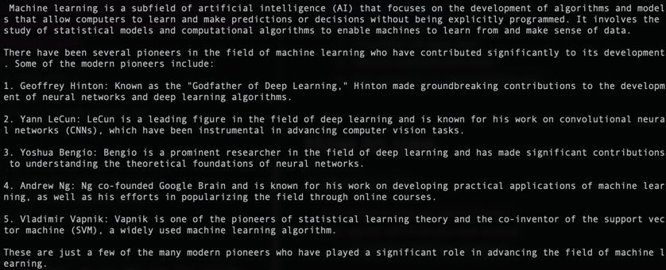

# Simple CLI Interface for OpenAI
Create a conversation interface with OpenAI. Conversation will be remembered up to context limit of the model.

# Setup
1. ```git clone https://github.com/lopez-hector/simple_OpenAI_chat.git```
   2. ```cd simple_OpenAI_chat```
2. [Set your OPENAI token ](https://auth0.openai.com/u/signup/identifier?state=hKFo2SAwV0FWYnB4NUhMUV9SeExNSGQ2TF84cnRSTWdiOVVGdKFur3VuaXZlcnNhbC1sb2dpbqN0aWTZIEJuajhKY1ZoM3prZFcwMnBYTC1PSXB5Nm1USUdKZzJwo2NpZNkgRFJpdnNubTJNdTQyVDNLT3BxZHR3QjNOWXZpSFl6d0Q)
3. Set up environment
   1. ```python -m venv env```
   2. ```source env/bin/activate```
   3. ```pip install -r requirements.txt```

# How to use
```python chat.py```
- will default to chat-gpt (gpt-3.5-turbo)
- can specify GPT-4 (if you have access)
  - ```python chat.py -m gpt-4```

## Entering text
It supports mult-line entry, so you may use the return key to continue your input.
> To submit your input, append with `/end`

## Exiting
Input `quit` and the chat interface will close.  
You may also of course escape.

# Example
### Starting chat interface
```python chat.py```

### First query (must end with `/end` to submit)


### Result
